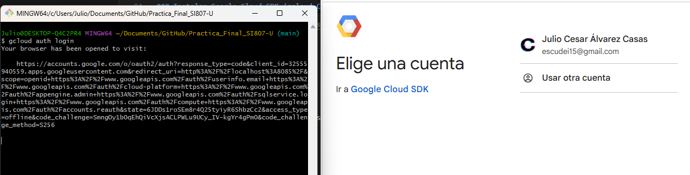

# Desarrollo del Examen Final- Julio Cesar Alvarez Casas

## 1. Justificación del Uso de la Nube – Google Cloud Platform (GCP)

### 1.1 Contexto del Proyecto BI

El presente proyecto consiste en la construcción en vivo de una solución completa de Business Intelligence en la nube, partiendo de uno o más archivos en formato CSV proporcionados durante el examen.  
El alcance de esta fase (BRONCE) contempla:

- Ingestión de datos sin modificar (raw).
- Estructuración básica y validaciones iniciales.
- Exploración inicial de los datos (EDA mínimo).
- Preparación para una arquitectura Medallion escalable.

Dado que el dataset puede variar en estructura, tamaño y dominio, la nube seleccionada debe ofrecer flexibilidad, rapidez de despliegue, bajo overhead operativo y costos mínimos, priorizando servicios serverless.

---

### 1.2 Criterios de Evaluación de la Nube

La selección de la plataforma cloud se basó en los siguientes criterios técnicos, aplicables a cualquier tipo de CSV:

- Soporte nativo para almacenamiento de archivos CSV.
- Escalabilidad automática para cargas batch.
- Modelo serverless (sin gestión de infraestructura).
- Bajo costo para ejecuciones esporádicas.
- Seguridad por defecto y trazabilidad.
- Integración directa con Python para análisis exploratorio.
- Compatibilidad con arquitectura Medallion (Bronce–Plata–Oro).

---

### 1.3 Comparación General: AWS vs Azure vs GCP

| Criterio | AWS | Azure | GCP |
|--------|-----|-------|-----|
| Almacenamiento de CSV | S3 (requiere configuración manual de seguridad) | ADLS Gen2 | Cloud Storage (seguridad por defecto) |
| Procesamiento batch | EMR / Glue (basado en clústeres) | Synapse Spark Pools | Dataproc Serverless |
| Gestión de infraestructura | Media–Alta | Media | Mínima |
| Escalamiento automático | Parcial | Parcial | Completo |
| Costos para uso académico | Moderados | Altos | Muy bajos / Free Tier |
| Integración con Python | Buena | Buena | Nativa y directa |
| Curva de aprendizaje | Media | Media–Alta | Baja |

---

### 1.4 Ventajas Clave de GCP para Ingestión de CSV (Capa Bronce)

Google Cloud Platform resulta especialmente adecuada para escenarios donde:

- El dataset es desconocido hasta el momento del examen.
- Se requiere cargar archivos CSV rápidamente mediante CLI.
- Se necesita ejecutar scripts Python de EDA sin aprovisionar clústeres.
- Las ejecuciones son puntuales o de baja frecuencia.

Ventajas técnicas principales:

- Cloud Storage permite almacenar archivos CSV sin esquema previo.
- Cifrado automático y auditoría habilitados por defecto.
- Dataproc Serverless permite ejecutar procesamiento bajo demanda.
- Facturación por uso real, evitando costos fijos.
- Ecosistema integrado que facilita la evolución hacia capas Plata y Oro.

---

### 1.5 Adecuación a Arquitectura Medallion

GCP se adapta de forma natural a una arquitectura Medallion:

```bash
/bronce
├── raw → CSV originales cargados vía CLI
├── processed → CSV con validaciones básicas y normalización inicial
└── curated → Datos listos para consumo analítico inicial
```

- Cloud Storage actúa como Data Lake en la capa Bronce.
- No se asume un esquema fijo; los CSV pueden variar en columnas y tipos.
- El procesamiento inicial se realiza mediante scripts Python, permitiendo:
  - Detección de valores nulos.
  - Identificación de tipos de datos.
  - Estadísticos descriptivos básicos.
  - Validaciones estructurales mínimas.

---

### 1.6 Decisión Final

Se seleccionó Google Cloud Platform (GCP) porque ofrece el mejor equilibrio entre simplicidad operativa, escalabilidad, seguridad y costos para una solución BI basada en archivos CSV de estructura variable.  
GCP permite implementar la capa BRONCE de forma rápida, reproducible y sin gestión de infraestructura, lo cual resulta ideal para un desarrollo en vivo y para una posterior evolución hacia una arquitectura analítica completa.
## CREACIÓN DEL PROYECTO
## Pre-requisitos

### Instalar Google Cloud SDK (gcloud CLI)

**En Windows:**
```powershell
# Descargar e instalar desde:
# https://cloud.google.com/sdk/docs/install

# Verificar instalación
gcloud --version
```

**En macOS/Linux:**
```bash
# Descargar instalador
curl https://sdk.cloud.google.com | bash

# Reiniciar terminal y verificar
gcloud --version
```

### 2. Autenticarse en GCP

```bash
# Iniciar sesión con tu cuenta de Google
gcloud auth login

# Esto abrirá tu navegador para autenticación
# Sigue los pasos en el navegador
```


## Inicio Rápido
### 1. Estructura local requerida

Antes de ejecutar el despliegue, se debe contar con la siguiente estructura local:
```bash
.
├── deploy.sh
├── destroy.sh
└── csv/
    ├── archivo1.csv
    ├── archivo2.csv
    └── ...
```

La carpeta csv/ contendrá todos los archivos CSV proporcionados en el examen.

### 2. Asignar permisos de ejecución
```bash
chmod +x deploy.sh destroy.sh
```
### 3. Despliegue automático de la Capa Bronce
```bash
./deploy.sh
```

Este script realiza automáticamente:

- Creación del proyecto en GCP.

- Creación del bucket de almacenamiento.

- Generación de la estructura Bronce.

- Carga de archivos CSV vía CLI.

- Creación de un clúster Dataproc para EDA inicial.

### Verificación de Resultados
Listar archivos cargados en Bronce (raw)
```bash
gsutil ls gs://examen-final-julio-cesar-bucket/bronce/raw/
```

### Uso del Clúster para EDA

El clúster Dataproc incluye Jupyter Notebook, accesible desde la consola de GCP mediante el Component Gateway.

Este clúster permite realizar un EDA inicial en Python o PySpark, incluyendo:

- Lectura directa de CSV desde Cloud Storage.

- Análisis de tipos de datos.

- Estadísticos descriptivos básicos.

- Identificación de valores nulos y duplicados.


### CREAR CLUSTER DATAPROC PARA EDA

```bash
gcloud dataproc clusters create practica-final-julio-alvarez-2 --enable-component-gateway --bucket practica-final-julio-alvarez-bucket-2 --region us-east1 --no-address --master-machine-type n1-standard-2 --master-boot-disk-size 100 --num-workers 2 --worker-machine-type n1-standard-2 --worker-boot-disk-size 200 --image-version 2.2-debian12 --optional-components JUPYTER,ZOOKEEPER --max-idle 7200s --max-age 7200s --scopes 'https://www.googleapis.com/auth/cloud-platform' --project practica-final-julio-alvarez-2
```


### Observación Final

La infraestructura creada corresponde exclusivamente a la Capa Bronce, asegurando ingestión reproducible, estructuración mínima y análisis exploratorio inicial, sentando las bases para la posterior evolución hacia Plata y Oro.

# 📓 EDA – Notebook Jupyter (Dataproc)

Objetivo: análisis exploratorio robusto sobre archivo1.csv, sin asumir esquema previo.

## 1. Importación de librerías
```python
import pandas as pd
import numpy as np
import matplotlib.pyplot as plt
import seaborn as sns

pd.set_option("display.max_columns", None)
plt.style.use("default")
```

## 2. Carga del dataset desde Cloud Storage
### Ruta del archivo en Cloud Storage

```python
GCS_PATH = "gs://examen-final-julio-cesar-bucket/bronce/raw/archivo1.csv"

### Lectura genérica del CSV
df = pd.read_csv(GCS_PATH)

### Vista inicial
df.head()
```

## 3. Estructura general del dataset
# Dimensiones del dataset
```python
print("Filas, Columnas:", df.shape)

# Tipos de datos
df.dtypes
```
## 4. Análisis de valores nulos
```python
# Conteo de nulos por columna

nulls = df.isnull().sum()

### Porcentaje de nulos
nulls_pct = (nulls / len(df)) * 100

nulls_df = pd.DataFrame({
    "nulos": nulls,
    "porcentaje (%)": nulls_pct
}).sort_values(by="porcentaje (%)", ascending=False)

nulls_df

Visualización de nulos:

plt.figure(figsize=(10, 4))
sns.heatmap(df.isnull(), cbar=False)
plt.title("Mapa de valores nulos")
plt.show()
```

## 5. Estadísticas descriptivas
```python
# Estadísticas para variables numéricas
df.describe()

#Para variables categóricas:

df.describe(include=["object"])
```
## 6. Distribución de variables numéricas
```python
numeric_cols = df.select_dtypes(include=np.number).columns

df[numeric_cols].hist(
    figsize=(14, 8),
    bins=20,
    edgecolor="black"
)

plt.suptitle("Distribución de variables numéricas")
plt.show()
```
## 7. Detección de valores atípicos (Outliers)

```python
for col in numeric_cols:
    plt.figure(figsize=(5, 3))
    sns.boxplot(x=df[col])
    plt.title(f"Boxplot - {col}")
    plt.show()
```

## 8. Correlaciones (si existen variables numéricas)

```python
if len(numeric_cols) >= 2:
    corr = df[numeric_cols].corr()

    plt.figure(figsize=(10, 6))
    sns.heatmap(corr, annot=True, cmap="coolwarm", fmt=".2f")
    plt.title("Matriz de correlación")
    plt.show()
else:
    print("No hay suficientes variables numéricas para correlación.")
```

## 9. Duplicados
```python
# Conteo de filas duplicadas
duplicados = df.duplicated().sum()
print("Filas duplicadas:", duplicados)
```